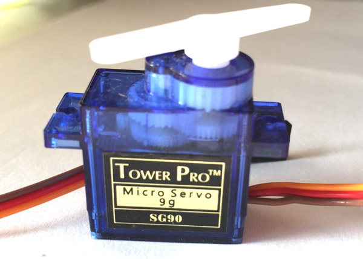
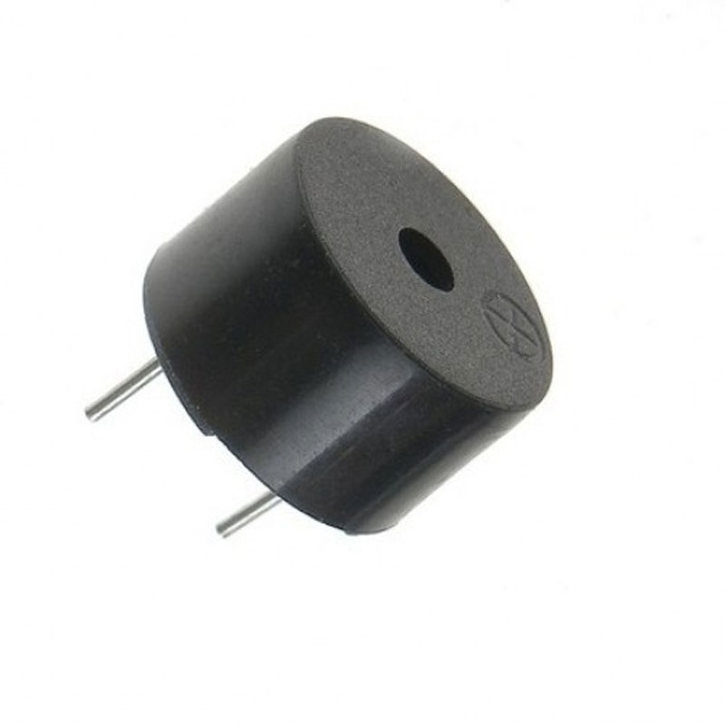

# Arduino Radar Project

## Overview:
This Arduino project detects and measure distance from the objects. Also, it makes beep sound when it detects an object and tells us how far is the object. It is inspired by Dejan with slight chnages in it.
It is made with simple materials which are easily available in the market and easy on pockets as well. 
you can take a look how it is going to look once its done.

## Repository Contents-
#### -Circuit Schemetics: 
*Here is the [circuit schemetics](https://github.com/msd9915358/Arduino-Radar-Project/tree/master/circuit%20schemetics) to give you detailed idea of the project. It is made by using fritzing software*

#### -Source code:
*Here is [code](https://github.com/msd9915358/Arduino-Radar-Project/blob/master/Source%20code) you need to know to make this project work.  Feel free to try new things with this code and be craetive.*

#### -Images
*Here are some extra [images](https://github.com/msd9915358/Arduino-Radar-Project/tree/master/Images) used to explain this project in detail*

#### -files
*In this folder there are [.ino files](https://github.com/msd9915358/Arduino-Radar-Project/tree/master/files) to upload and see the result *

#### -Original Pictures:
*Here we included some [Pictures](https://github.com/msd9915358/Arduino-Radar-Project/tree/master/original%20pictures) of the original project to give you the better idea about the project.*

## Materials required:
1. Arduino Board                          

2. Ultrasonic Sensor

3. Servo Motor

4. Piezo Speaker

5. Breadboard and jumper cables                    

## Purpose:
In this Arduino Project is an Ultrasonic Sensor for detecting the objects, a small hobbyist Servo Motor for rotating the sensor and an Arduino Board for controlling them.

## Build Instructions:
As we can see in the diagram below, 
- first of all we connect servo motor with arduino
- secondly connect the Ultrasonic Sensor with arduino using different pins
- also connect peizo speaker to hear the beep sound as the object comes closer
we can see all this in the schemetic

## Diagram:
Below is the diagram to show the things in detail

## Usage:
- upload the code file with help of your PC in the arduino
- you can see the yellow lights blinking on the arduino board when its done uploading
- Ultarsonic Sensor would start rotating with the help of servo motor
- whenever this setup comes closer to any obstacle, the peizo speaker will start beeping 
- you'll know when the object comes too close and can avoid the collision

## Team:
The project is made by:
- Mehakdeep Singh   *(documentation and assembling)*
- Ishwar Singh     *(mostly software part and assembling)*
- Karamdeep Singh  *(came up with the ideas and assembling)*

## Credits:
Dejan. (2015). Arduino Radar Project. [online] HowToMechatronics. Available at:
https://howtomechatronics.com/projects/arduino-radar-project/

[Accessed 2April, 2020]

 

